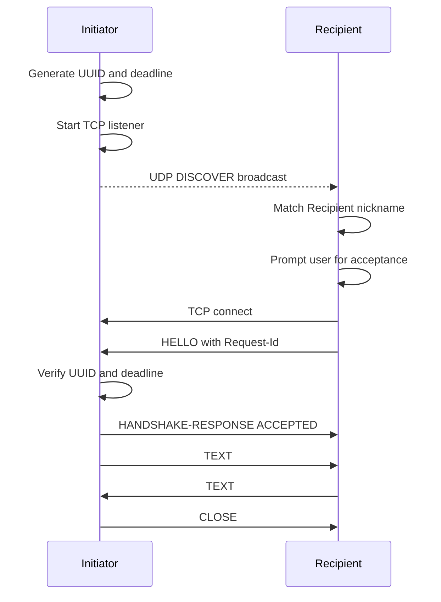
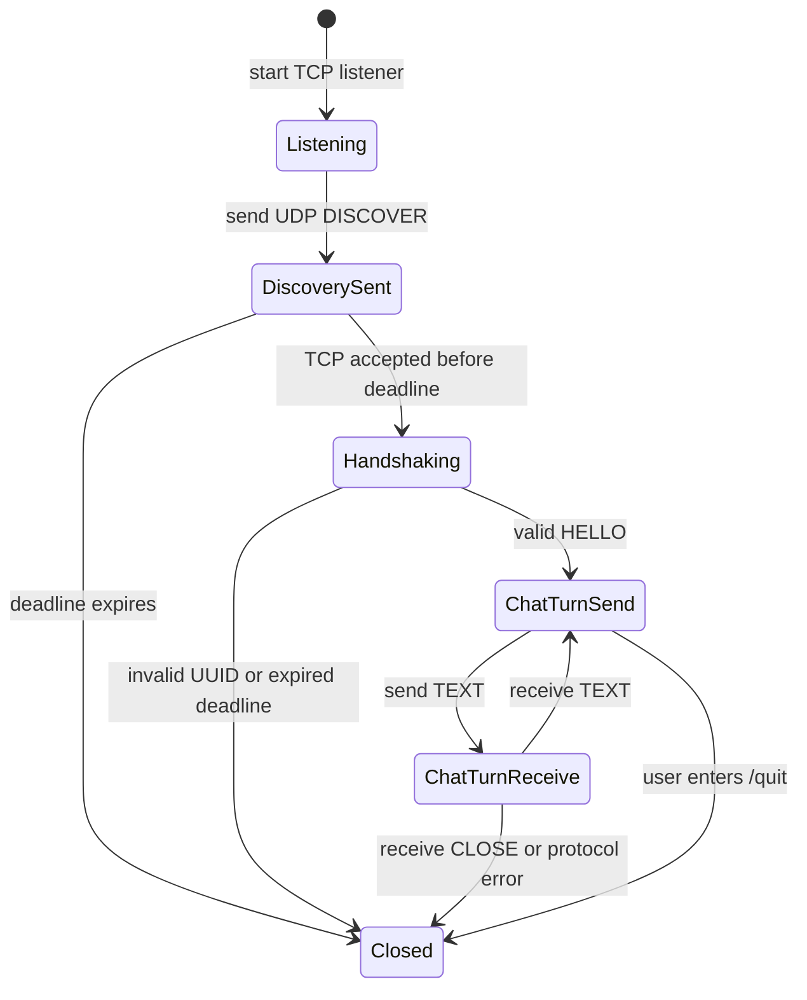
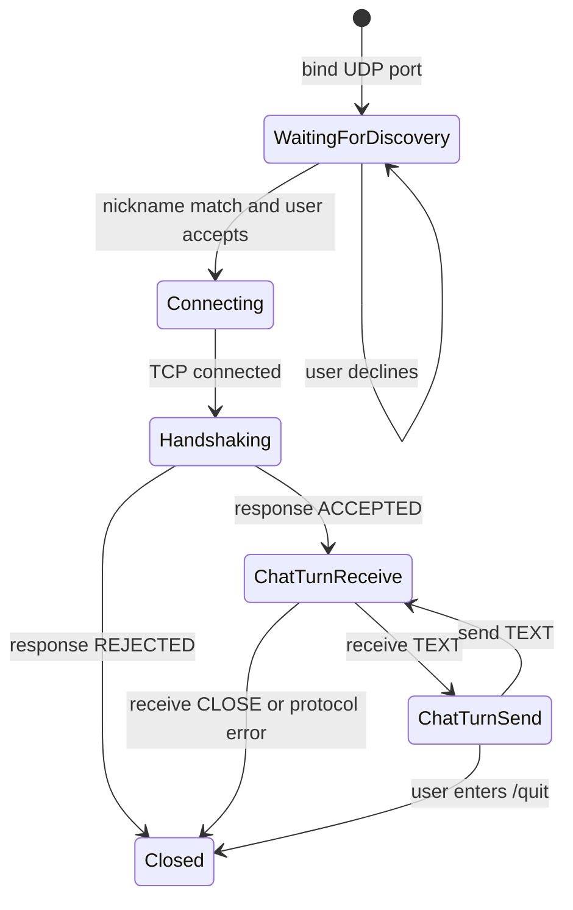

# LNCP/1.0 Local Network Chat Protocol

## Overview and Design Goals

LNCP is a small application-layer protocol for discovering and starting a local network chat session. It uses UDP broadcast for discovery and TCP for reliable handshaking and text exchange.

Design goals:

- Human-readable frames that are easy to inspect during a demo.
- Explicit message type prefixes for discovery, handshake, chat, and close operations.
- Request correlation with a UUID so stale or unrelated TCP connections can be rejected.
- Deadline enforcement so broadcast requests do not remain valid indefinitely.
- Turn-based simplex chat: one side sends a text message, then waits for a response before sending again.

LNCP is inspired by classic text protocols such as HTTP, SMTP, and FTP: each frame starts with a protocol/version token and a command-like message type, followed by headers and an optional body.

## Transport and Encoding

| Rule | Definition |
| --- | --- |
| Discovery transport | UDP broadcast |
| Chat transport | TCP |
| Character encoding | UTF-8 |
| Header line endings | CRLF preferred; LF tolerated by the parser |
| Header format | `Name: Value` |
| Frame start line | `LNCP/1.0 <MESSAGE-TYPE>` |
| Header terminator | Empty line |
| Text body framing | `Length` header gives the UTF-8 byte count |
| Maximum header bytes | 8192 |
| Maximum text body bytes | 65536 |

Header names are case-insensitive. Header values must not contain CR or LF. UUID fields use the standard GUID string format. Deadlines use UTC ISO-8601 timestamps.

## Message Types

### DISCOVER

Sent by the initiator over UDP broadcast.

```text
LNCP/1.0 DISCOVER
Request-Id: <uuid>
Recipient: <nickname>
Deadline-Utc: <ISO-8601 UTC timestamp>
Tcp-Port: <port>
```

| Header | Required | Description |
| --- | --- | --- |
| `Request-Id` | Yes | Random UUID identifying this communication request. |
| `Recipient` | Yes | Intended recipient nickname. |
| `Deadline-Utc` | Yes | Last UTC time at which the request may be accepted. |
| `Tcp-Port` | Yes | TCP port where the initiator is listening. |

### HELLO

Sent by the recipient after connecting to the initiator over TCP.

```text
LNCP/1.0 HELLO
Request-Id: <uuid>
```

| Header | Required | Description |
| --- | --- | --- |
| `Request-Id` | Yes | UUID copied from the matching discovery request. |

### HANDSHAKE-RESPONSE

Sent by the initiator after validating the HELLO frame.

```text
LNCP/1.0 HANDSHAKE-RESPONSE
Status: ACCEPTED
Reason: OK
```

or:

```text
LNCP/1.0 HANDSHAKE-RESPONSE
Status: REJECTED
Reason: <human-readable reason>
```

| Header | Required | Description |
| --- | --- | --- |
| `Status` | Yes | `ACCEPTED` or `REJECTED`. |
| `Reason` | Yes | Explanation for the result. |

### TEXT

Sent over TCP after a successful handshake.

```text
LNCP/1.0 TEXT
Length: <byte-count>

<UTF-8 body>
```

| Header | Required | Description |
| --- | --- | --- |
| `Length` | Yes | Exact UTF-8 byte length of the message body. |

The body is the chat text. In the console applications, each user-entered line is sent as one TEXT frame.

### CLOSE

Sent over TCP to terminate a session intentionally or after a protocol error.

```text
LNCP/1.0 CLOSE
Reason: <human-readable reason>
```

| Header | Required | Description |
| --- | --- | --- |
| `Reason` | No | Explanation for closing the connection. |

## Communication Workflow



## State Transitions

### Initiator



### Recipient



## Error Handling

| Condition | Behavior |
| --- | --- |
| UDP frame is malformed | Recipient ignores it and continues listening. |
| Recipient nickname does not match | Recipient ignores the discovery request. |
| User declines request | Recipient does not open a TCP connection. |
| TCP HELLO has wrong UUID | Initiator sends `HANDSHAKE-RESPONSE` with `REJECTED`. |
| Deadline expired | Initiator rejects the handshake or recipient ignores the discovery. |
| Unexpected frame type during chat | Peer sends `CLOSE` and terminates. |
| Invalid headers or body length | Peer rejects or closes with a clear reason. |
| `/quit` entered | Application sends `CLOSE` and exits. |
| `Ctrl+C` pressed | Application cancels the current wait and exits. |

## Running the Applications

Start the recipient in one terminal:

```bash
dotnet run --project LNCP.Recipient -- --nickname alice --discovery-port 45678
```

Start the initiator in another terminal:

```bash
dotnet run --project LNCP.Initiator -- --recipient alice --tcp-port 5001 --deadline-seconds 60 --discovery-port 45678
```

For same-machine testing, if UDP broadcast is blocked by the operating system or firewall, use the loopback address as the broadcast target:

```bash
dotnet run --project LNCP.Initiator -- --recipient alice --broadcast-address 127.0.0.1
```

## Assumptions and Limitations

- LNCP is intended for local network demonstrations, not untrusted internet use.
- There is no encryption, authentication, replay protection, or identity verification beyond nickname matching and UUID correlation.
- UDP broadcast delivery is not guaranteed and may be blocked by network or firewall settings.
- The first valid recipient that accepts and connects wins; the initiator handles one TCP chat session per request.
- The console implementation sends one user-entered line per TEXT frame.
- Nicknames must be non-empty printable text and cannot contain control characters.
